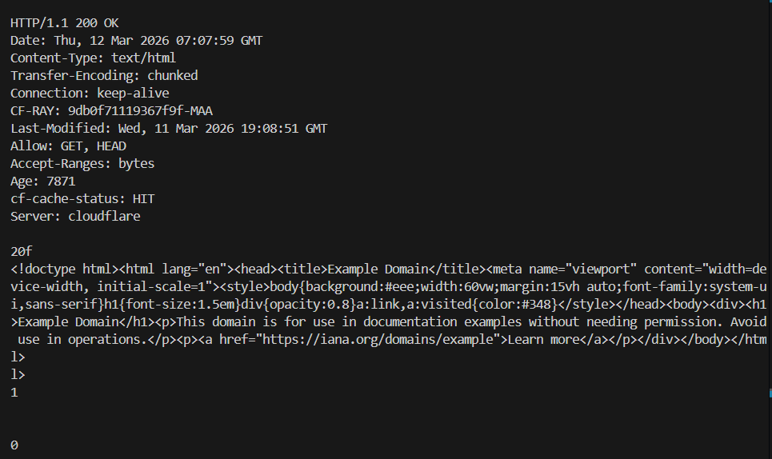
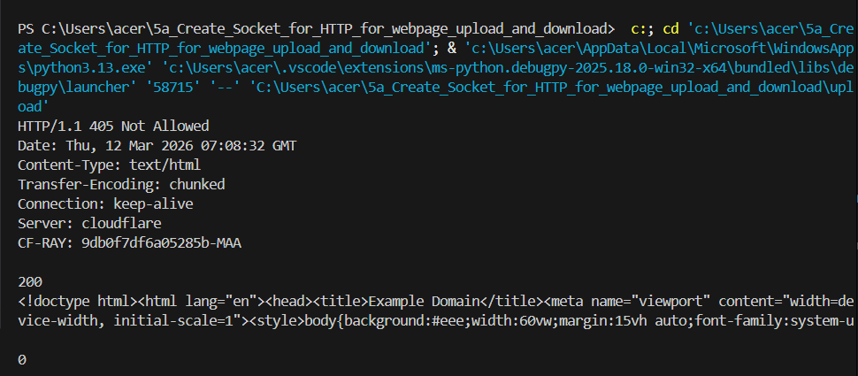

# 5a_Create_Socket_for_HTTP_for_webpage_upload_and_download
## AIM :
To write a PYTHON program for socket for HTTP for web page upload and download
## Algorithm
1.Start the program.

2.Create a socket at the server side and bind it to localhost and port 8080.

3.Put the server in listening mode.

4.Create a client socket and connect it to the server.

5.Display options Download or Upload to the user.

6.If Download is selected, the client sends an HTTP GET request and receives the webpage from the server.

7.If Upload is selected, the client sends an HTTP POST request with data to the server.

8.The server processes the request and sends a response to the client.

9.Close the connection.

10.Stop the program.
## Program
``` 
server:
import socket

def download_page(host, path):
    port = 80

    s = socket.socket(socket.AF_INET, socket.SOCK_STREAM)
    s.connect((host, port))

    request = f"GET {path} HTTP/1.1\r\nHost: {host}\r\n\r\n"
    s.send(request.encode())

    response = s.recv(4096).decode()

    print("Server Response:\n")
    print(response)

    s.close()


host = "example.com"
path = "/"

download_page(host, path)
```
client:
```
import socket

def upload_file(host, port, filename):

    with open(filename, "rb") as file:
        data = file.read()

    content_length = len(data)

    request = (
        f"POST /upload HTTP/1.1\r\n"
        f"Host: {host}\r\n"
        f"Content-Length: {content_length}\r\n\r\n"
    )

    s = socket.socket(socket.AF_INET, socket.SOCK_STREAM)
    s.connect((host, port))

    s.send(request.encode() + data)

    response = s.recv(4096).decode()
    print(response)

    s.close()


host = "example.com"
port = 80
filename = "example.txt"

upload_file(host, port, filename)
```
```
```

## OUTPUT :
download:

upload:

## Result
Thus the socket for HTTP for web page upload and download created and Executed
